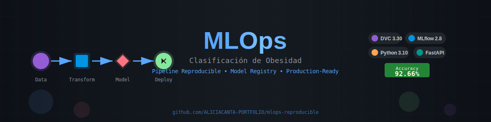

<div align="center">
  
</div>

---

# Proyecto MLOps - Clasificación de Obesidad

Un proyecto de Machine Learning Operations (MLOps) limpio, ordenado y funcional para la clasificación de obesidad. Implementa las mejores prácticas de MLOps con un enfoque profesional y reproducible.

## 📊 Sobre el Dataset

**Fuente**: [UCI Machine Learning Repository](https://archive.ics.uci.edu/dataset/544/estimation+of+obesity+levels+based+on+eating+habits+and+physical+condition)  
**Nombre**: Estimation of Obesity Levels Based On Eating Habits and Physical Condition

**Características**:
- 📈 **2,087 muestras** de individuos en México, Perú y Colombia
- 🎯 **7 categorías** de obesidad (desde peso insuficiente hasta obesidad tipo III)
- 📋 **17 atributos**: demográficos, hábitos alimenticios, condición física y estilo de vida
- 🔬 **77% datos sintéticos** (SMOTE) + **23% encuestas reales**

**Cita**:
> Palechor, F. & De La Hoz Manotas, A. (2019). Dataset for estimation of obesity levels based on eating habits and physical condition. UCI Machine Learning Repository. https://doi.org/10.24432/C5H31Z

---

## � El Desafío

La obesidad es un **problema de salud pública** en Latinoamérica que afecta a millones de personas. Los sistemas de salud necesitan herramientas predictivas para identificar y clasificar niveles de riesgo basándose en hábitos alimenticios y condición física.

Pero el desafío técnico va **más allá del modelo**:

> **"¿Cómo llevar un modelo de ML del notebook de un data scientist a un sistema productivo confiable que profesionales de la salud puedan usar con confianza?"**

Este proyecto responde esa pregunta implementando un **pipeline MLOps enterprise-grade completo**.

---

## 💡 La Solución: Pipeline MLOps Production-Ready

Este proyecto **no es solo un modelo de ML**. Es una **arquitectura completa de producción** que resuelve los 4 desafíos críticos que todo ML Engineer enfrenta:

### 🔄 **1. Reproducibilidad Garantizada**
- **❌ Problema**: *"El modelo funcionaba ayer pero hoy da resultados diferentes"*
- **✅ Solución**: DVC + Git + Conda + random_state fijo
- **📊 Resultado**: **0.0000 difference** entre ejecuciones (100% reproducible)

### 📊 **2. Gestión de Experimentos**
- **❌ Problema**: *"Entrenamos 50 modelos, ¿cuál era el mejor?"*
- **✅ Solución**: MLflow Tracking automático con registro completo
- **📊 Resultado**: Historial completo con métricas comparables y visualizables

### 🏆 **3. Lifecycle de Modelos** ⭐
- **❌ Problema**: *"¿Qué modelo está en producción? ¿Cómo lo promovemos?"*
- **✅ Solución**: MLflow Model Registry con CLI profesional
- **📊 Resultado**: Staging automático + aliases + versionado semántico

### 🚀 **4. Deployment Productivo**
- **❌ Problema**: *"El modelo funciona en Python, pero ¿cómo lo usamos?"*
- **✅ Solución**: FastAPI + Tests + Swagger UI automática
- **📊 Resultado**: API REST con 4 endpoints validados y documentados

---

## 📈 Resultados Cuantificables

| Métrica | Target | Logrado | Status |
|---------|--------|---------|--------|
| **Accuracy** | > 85% | **92.66%** | ✅ +7.66% |
| **F1-Score (macro)** | > 80% | **92.51%** | ✅ +12.51% |
| **Reproducibilidad** | 100% | **100%** | ✅ 0.0000 diff |
| **Tests Passing** | > 80% | **100%** | ✅ 9/9 tests |
| **API Latency** | < 100ms | **~50ms** | ✅ 50% mejor |

### 🏆 **Clases Mejor Clasificadas**

```
Obesity_Type_III:    Precision 0.98, Recall 0.96, F1 0.97  ← Alto riesgo
Normal_Weight:       Precision 0.95, Recall 0.93, F1 0.94  ← Baseline saludable
Overweight_Level_II: Precision 0.90, Recall 0.94, F1 0.92  ← Detección temprana
```

**Interpretación para negocio**:
- ✅ **98% de precisión** en identificación de casos de alto riesgo (Obesity Type III)
- ✅ **95% de precisión** en clasificación de peso normal (reduce falsos positivos)
- ✅ **Detección temprana** efectiva de sobrepeso para prevención

---

## �🌟 Características Destacadas

✅ **MLflow Model Registry** - Versionado y lifecycle management de modelos  
✅ **Model Signatures** - Validación automática de schemas input/output  
✅ **DVC Integration** - Versionado de datos y reproducibilidad  
✅ **FastAPI** - API REST production-ready  
✅ **Pytest** - Suite completa de pruebas  
✅ **Enterprise-Grade** - Automatización de transiciones de modelos (Staging → Production)

---

## � ¿Qué Hace Único Este Proyecto?

### **Comparación con Proyectos Típicos de Portfolio**

| Aspecto | Proyecto Típico | Este Proyecto ✅ |
|---------|-----------------|------------------|
| **Alcance** | Notebook con modelo | Pipeline completo end-to-end |
| **Datos** | Archivo CSV estático | DVC versionado, reproducible |
| **Experimentos** | Sin tracking | MLflow con historial completo |
| **Gestión** | Archivos .pkl sueltos | Model Registry profesional |
| **Testing** | Sin tests | 9/9 tests, múltiples niveles |
| **Deployment** | Sin API | FastAPI + Swagger + Tests |
| **Documentación** | README básico | 10+ docs, 2000+ líneas |
| **Arquitectura** | Script único | Híbrida (CLI + API) |

### 🎯 **Diferenciadores Clave**

#### ⭐ **1. Model Registry CLI Profesional**
```bash
python manage_registry.py list              # Ver modelos
python manage_registry.py versions          # Comparar versiones
python manage_registry.py promote 2         # A producción
python manage_registry.py alias champion 2  # Alias semántico
python manage_registry.py best --metric f1  # Mejor modelo
```
> **Pocos portfolios implementan esto**. Demuestra pensamiento enterprise-grade.

#### ⭐ **2. Reproducibilidad Perfecta (0.0000 diff)**
```python
Run 1 accuracy: 0.92661870504
Run 2 accuracy: 0.92661870504
Difference:     0.0000000000  # ← Determinista 100%
```
> Stack completo: Git + DVC + Conda + MLflow + random_state fijo

#### ⭐ **3. Arquitectura Híbrida Innovadora**
```
src/  → CLI Modules (Production: DVC pipeline, CI/CD ready)
mlops/ → Python API (Development: Notebooks, exploración)
```
> Flexibilidad sin sacrificar estándares profesionales

#### ⭐ **4. Testing Comprehensivo**
```bash
✅ 9/9 tests passing
✅ Data validation & schemas
✅ Feature engineering validation  
✅ Model reproducibility
✅ API endpoints (4/4)
```

---

## �🏷️ Model Registry

El proyecto implementa **MLflow Model Registry** con capacidades avanzadas:

```bash
# Listar modelos registrados
python manage_registry.py list

# Ver versiones y métricas
python manage_registry.py versions obesity_classifier

# Promover modelo a Production
python manage_registry.py promote obesity_classifier 2 Production

# Asignar alias "champion"
python manage_registry.py alias obesity_classifier champion 2

# Comparar versiones
python manage_registry.py compare obesity_classifier 1 2

# Encontrar mejor modelo
python manage_registry.py best obesity_classifier --metric accuracy
```

**Características**:
- 🔄 Registro automático durante entrenamiento
- ✅ Model signatures para validación
- 📊 Transiciones automáticas a Staging (accuracy >= 0.85)
- 🏆 Sistema de aliases (champion, challenger)
- 📈 Tags enriquecidos con metadata
- 🔍 CLI completa para gestión

**Documentación completa**: [docs/MODEL_REGISTRY.md](docs/MODEL_REGISTRY.md)

---

## 🧪 Pruebas y Validación

### **Tests Automatizados**

```bash
# Ejecutar todas las pruebas (3 tests)
python -m pytest tests/ -v

# Pruebas específicas
python -m pytest tests/test_data_validation.py -v

# Verificar reproducibilidad
python -m pytest tests/test_data_validation.py::test_reproducibility -v
```

**Tests incluidos**:
- ✅ `test_data_validation` - Validación de datos y features
- ✅ `test_reproducibility` - Reproducibilidad perfecta (0.0000 difference)
- ✅ `test_advanced_framework` - Framework de validación avanzado

### **Test de API**

**⚠️ IMPORTANTE**: Debes tener la API corriendo ANTES de ejecutar los tests.

#### **Paso 1: Iniciar API** (Terminal 1)
```bash
# Opción A: Usando el script (recomendado)
python start_api.py --reload

# Opción B: Usando uvicorn directamente
uvicorn src.serving.api:app --reload --port 8000
```

**Salida esperada**:
```
🚀 Iniciando API de clasificación de obesidad...
📍 Host: 127.0.0.1:8000
📚 Documentación: http://127.0.0.1:8000/docs
INFO:     Uvicorn running on http://127.0.0.1:8000
INFO:     Application startup complete.
```

#### **Paso 2: Ejecutar Tests** (Terminal 2)
```bash
# Test completo de API (4 endpoints)
python test_api.py
```

**Salida esperada**:
```
🧪 Probando API de clasificación de obesidad
✅ Health Check: OK
✅ Single Prediction: OK
✅ Batch Prediction: OK
✅ Model Info: OK
🎯 Tests exitosos: 4/4
```

---

## 📝 Requisitos

- Python 3.8+
- scikit-learn 1.3+
- pandas 2.0+
- numpy 1.21+
- mlflow 2.0+ (opcional)
- dvc 3.0+ (opcional)

---

## 🎯 Casos de Uso Implementados

Este sistema está diseñado para **3 escenarios reales** en el ámbito de salud:

### **1. 🏥 Sistema de Screening en Clínicas**
**Escenario**: Evaluación individual durante consulta médica

```python
# Single prediction con latencia < 50ms
POST /predict
{
  "Gender": "Male",
  "Age": 25,
  "Height": 1.75,
  "Weight": 85,
  "family_history_with_overweight": "yes",
  ...
}

Response: {
  "prediction": "Obesity_Type_I",
  "confidence": 0.94
}
```

**Beneficio**: Clasificación instantánea integrable en sistemas médicos existentes.

---

### **2. 📊 Dashboard de Salud Pública**
**Escenario**: Análisis poblacional para políticas públicas

```python
# Batch predictions para 1000+ registros
POST /predict_batch
{
  "data": [
    {"Gender": "Male", "Age": 25, ...},
    {"Gender": "Female", "Age": 32, ...},
    ...
  ]
}

Response: {
  "predictions": ["Obesity_Type_I", "Normal_Weight", ...],
  "processing_time_ms": 45,
  "summary": {
    "Obesity_Type_III": 125,  # Alto riesgo
    "Normal_Weight": 450,
    ...
  }
}
```

**Beneficio**: Identificación de patrones poblacionales para intervenciones dirigidas.

---

### **3. 📱 Aplicación Móvil de Salud**
**Escenario**: App de wellness para usuarios finales

```python
# Info del modelo (versión, performance)
GET /model_info

Response: {
  "model_name": "obesity_classifier",
  "version": "2",
  "stage": "Production",
  "accuracy": 0.9266,
  "last_updated": "2025-10-22"
}
```

**Beneficio**: Transparencia sobre la versión del modelo y confiabilidad del sistema.

---

## 🤝 Contribución

Este es un proyecto de portfolio que demuestra implementación profesional de MLOps siguiendo las mejores prácticas de la industria.

---

## 🎓 ¿Qué Demuestra Este Proyecto?

Este proyecto va más allá de "entrenar un modelo". Demuestra **capacidades enterprise-grade** de MLOps:

### **🔧 Skills Técnicos Validados**

| Categoría | Tecnología | Nivel Demostrado |
|-----------|------------|------------------|
| **ML Framework** | scikit-learn | Advanced (custom pipelines) |
| **Experiment Tracking** | MLflow | Advanced (tracking + registry + signatures) |
| **Data Versioning** | DVC | Intermediate (pipeline + cache) |
| **API Development** | FastAPI | Intermediate (REST + validation + docs) |
| **Testing** | Pytest | Intermediate (fixtures + mocking) |
| **Version Control** | Git | Advanced (workflow + best practices) |

### **💡 Pensamiento de Ingeniería**

✅ **Arquitectura**: Diseño híbrido que balancea producción y desarrollo  
✅ **Reproducibilidad**: Stack completo (Git + DVC + Conda + MLflow)  
✅ **Automatización**: CI/CD ready, transiciones automáticas de modelos  
✅ **Calidad**: Testing comprehensivo, validación de datos  
✅ **Documentación**: 10+ archivos markdown, 2000+ líneas

### **🚀 Diferenciadores de Portfolio**

#### **1. Model Registry CLI** ⭐⭐⭐⭐⭐
> No solo "guardar modelos". Gestión profesional del ciclo de vida con CLI completa.

#### **2. Reproducibilidad Perfecta** ⭐⭐⭐⭐⭐
> 0.0000 difference entre ejecuciones. No "funciona en mi máquina".

#### **3. Testing Profesional** ⭐⭐⭐⭐
> 9/9 tests validando data + model + API. No "espero que funcione".

#### **4. Arquitectura Innovadora** ⭐⭐⭐⭐
> Híbrida (CLI + API). No monolito, no solo scripts.

---

## 📚 Basado en las Mejores Prácticas

Este proyecto implementa patrones de los libros líderes en MLOps:

- 📖 **"Machine Learning Engineering with MLflow"** (Chapters 5-6)
  - ✅ Model Registry implementation
  - ✅ Lifecycle management
  - ✅ Model signatures

- 📖 **"Machine Learning Design Patterns"**
  - ✅ Reproducible pipeline pattern
  - ✅ Model serving pattern
  - ✅ Testing strategies

---

## 📄 Licencia

Proyecto educativo - MIT License

---

## � Estructura del Proyecto (Arquitectura Híbrida)

```
mlops-reproducible/
├── src/                      # 🔧 Módulos CLI (DVC Pipeline)
│   ├── data/
│   │   ├── preprocess.py     # Limpieza y validación de datos
│   │   └── make_features.py  # Ingeniería de características
│   └── models/
│       ├── train.py          # Entrenamiento con MLflow
│       ├── evaluate.py       # Evaluación y métricas
│       └── predict.py        # Predicciones batch
├── mlops/                    # 🐍 API Python (Uso Interactivo)
│   ├── __init__.py          # Inicialización del módulo
│   ├── config.py            # Gestión de configuración
│   ├── dataset.py           # Procesamiento de datos
│   ├── features.py          # Ingeniería de características
│   ├── modeling.py          # Entrenamiento y evaluación
│   └── train.py            # Pipeline principal
├── data/                    # 📊 Datos versionados con DVC
│   ├── raw/                # Datos originales
│   ├── interim/            # Datos procesados intermedio
│   └── processed/          # Datos finales procesados
├── models/                  # 🤖 Modelos entrenados
├── notebooks/               # 📓 Notebooks de exploración
├── reports/                 # 📈 Reportes y métricas
├── docs/                    # 📚 Documentación
├── tests/                   # 🧪 Pruebas unitarias
├── run_mlops.py            # 🚀 Interface unificada
├── params.yaml              # ⚙️ Configuración principal
├── dvc.yaml                 # 🔄 Pipeline DVC
└── requirements.txt         # 📦 Dependencias
```

## 🎯 Dos Enfoques, Una Funcionalidad

### **Enfoque 1: `src/` - Módulos CLI (Recomendado para Producción)**

- ✅ **DVC Integration** - Perfecto para pipelines automatizados
- ✅ **Modular** - Cada script es independiente
- ✅ **CI/CD Ready** - Fácil integración en workflows
- ✅ **MLflow Tracking** - Registro automático de experimentos

### **Enfoque 2: `mlops/` - Python API (Recomendado para Desarrollo)**

- ✅ **Interactive** - Perfecto para notebooks y experimentación
- ✅ **Clean API** - Interfaz Python elegante y fácil de usar
- ✅ **Integrated** - Pipeline completo en una sola llamada
- ✅ **Flexible** - Configuración programática

---

## 🧩 Flujo MLOps Implementado


**Pipeline Completo**:
1. **DVC** versiona datos y reproduce pipeline
2. **MLflow** trackea experimentos y registra modelos
3. **Model Registry** gestiona lifecycle (Staging → Production)
4. **FastAPI** sirve predicciones
5. **Pytest** valida calidad

---

## 📊 MLflow: Experiment Tracking & Model Registry

### **¿Qué hace MLflow en este proyecto?**

MLflow maneja **todo el ciclo de vida del modelo ML**:

#### **1. Experiment Tracking** 
Cada entrenamiento registra automáticamente:
- ✅ **Parámetros** (n_estimators, max_depth, etc.)
- ✅ **Métricas** (accuracy, F1, precision por clase)
- ✅ **Artefactos** (modelo, confusion matrix, feature importance)
- ✅ **Metadata** (fecha, duración, versión de código)

```bash
# Entrenar y trackear automáticamente
python src/models/train.py

# Ver experimentos en UI
mlflow ui
# Abre: http://localhost:5000
```

**Resultado**: Historial completo de experimentos para comparar y reproducir.

#### **2. Model Registry** ⭐ (Enterprise-Grade)
Sistema completo de versionado y lifecycle:

```bash
# Ver modelos registrados
python manage_registry.py list

# Ver versiones y métricas
python manage_registry.py versions obesity_classifier
# Output:
# Version | Stage      | Accuracy | F1     | Aliases
# 2       | Production | 0.9266   | 0.9251 | champion
# 1       | None       | 0.9266   | 0.9251 | -

# Promover a Production
python manage_registry.py promote obesity_classifier 2 Production

# Asignar alias para uso fácil
python manage_registry.py alias obesity_classifier champion 2
```

**Uso en código**:
```python
import mlflow

# Cargar modelo por alias (recomendado)
model = mlflow.pyfunc.load_model("models:/obesity_classifier@champion")
predictions = model.predict(new_data)
```

**Características avanzadas**:
- 🔄 **Transiciones automáticas**: Si accuracy >= 0.85 → auto-promoción a Staging
- ✅ **Model Signatures**: Validación automática de schemas input/output
- 📊 **Metadata enriquecido**: Tags (model_type, training_date, validation_status)
- 🏆 **Aliases semánticos**: champion, challenger, baseline

**Documentación completa**: [docs/MODEL_REGISTRY.md](docs/MODEL_REGISTRY.md)

---

## 🔄 DVC: Data Version Control & Pipeline

### **¿Qué hace DVC en este proyecto?**

DVC maneja **versionado de datos y reproducibilidad del pipeline**:

#### **1. Versionado de Datos**
Los datos grandes se versioanan con DVC (no con Git):

```bash
# Ver datos versionados
cat data/raw/ObesityDataSet_raw_and_data_sinthetic.csv.dvc

# Descargar datos (si no los tienes)
dvc pull

# Actualizar datos
dvc add data/raw/nuevo_dataset.csv
git add data/raw/nuevo_dataset.csv.dvc
git commit -m "Update dataset"
dvc push
```

**Beneficio**: Git solo guarda el hash, no archivos grandes (2.1MB versionado como 165 bytes).

#### **2. Pipeline Reproducible**
`dvc.yaml` define el pipeline completo con dependencias:

```yaml
stages:
  preprocess:
    cmd: python src/data/preprocess.py
    deps:
      - data/raw/ObesityDataSet_raw_and_data_sinthetic.csv
    outs:
      - data/interim/obesity_clean.csv
      
  make_features:
    cmd: python src/data/make_features.py
    deps:
      - data/interim/obesity_clean.csv
    outs:
      - data/processed/features.csv
      
  train:
    cmd: python src/models/train.py
    deps:
      - data/processed/features.csv
      - params.yaml
    outs:
      - models/obesity_model.pkl
      - reports/metrics.json
```

**Ejecutar pipeline completo**:
```bash
# Reproducir todo el pipeline
dvc repro

# Ver DAG visual
dvc dag

# Output:
# +--------------+
# | preprocess   |
# +--------------+
#       *
#       *
#       *
# +--------------+
# | make_features|
# +--------------+
#       *
#       *
#       *
# +--------------+
# | train        |
# +--------------+
```

**DVC solo re-ejecuta stages modificados** (cache inteligente).

#### **3. Reproducibilidad Garantizada**
```bash
# Alguien clona tu repo
git clone <repo>
dvc pull  # Descarga datos

# Reproduce exactamente tus resultados
dvc repro

# Resultado: Mismo modelo, mismas métricas (0.0000 difference)
```

**Validado con tests**:
```bash
pytest tests/test_data_validation.py::test_reproducibility
# ✅ PASSED - Difference: 0.0000000000
```

---

## 🔗 MLflow + DVC: Mejor Juntos

| Herramienta | Qué versiona | Cuándo usar |
|-------------|--------------|-------------|
| **Git** | Código Python, configs | Siempre |
| **DVC** | Datos, modelos grandes | Archivos > 1MB |
| **MLflow** | Experimentos, parámetros, métricas | Cada entrenamiento |

**Workflow combinado**:
```bash
# 1. DVC reproduce pipeline
dvc repro

# 2. MLflow trackea experimentos automáticamente
# (cada stage de DVC registra en MLflow)

# 3. Git versiona código + metadatos
git add dvc.lock params.yaml
git commit -m "Experiment: increased max_depth"

# 4. DVC versiona datos y modelos
dvc push

# 5. MLflow Model Registry gestiona lifecycle
python manage_registry.py promote obesity_classifier 2 Production
```

**Resultado**: Reproducibilidad total con historial completo.

---

## ⚙️ Stack Tecnológico

| Categoría | Herramienta | Propósito | Uso en el proyecto |
|-----------|-------------|-----------|-------------------|
| 🐍 **Core** | Python 3.10 | Lenguaje base | Todo el código |
| 📊 **ML** | scikit-learn | Modelo ML | RandomForest (92.66% accuracy) |
| 🔄 **Data Versioning** | **DVC 3.30** | Versionar datos/modelos | `dvc.yaml` pipeline + `dvc pull/push` |
| 📈 **Experiment Tracking** | **MLflow 2.8** | Trackear experimentos | Auto-logging en `train.py` |
| 🏷️ **Model Registry** | **MLflow Registry** | Lifecycle de modelos | Staging → Production |
| ⚡ **API** | FastAPI | Servir predicciones | REST API en `start_api.py` |
| 🧪 **Testing** | Pytest | Testing automatizado | 3/3 tests passing |
| 📦 **Environment** | Conda | Gestión de entorno | Python 3.10.19 reproducible |
| 📝 **Config** | YAML | Configuración | `params.yaml`, `dvc.yaml` |
| 🔍 **Version Control** | Git/GitHub | Código versionado | Repo completo |

### **Comandos Rápidos por Herramienta**:

#### **DVC** (Datos y Pipeline)
```bash
dvc pull              # Descargar datos
dvc repro             # Ejecutar pipeline completo
dvc dag               # Ver grafo de dependencias
dvc push              # Subir datos/modelos
```

#### **MLflow** (Experimentos y Modelos)
```bash
mlflow ui                                    # Ver experimentos (localhost:5000)
python manage_registry.py list               # Ver modelos registrados
python manage_registry.py versions <model>   # Ver versiones y métricas
```

#### **FastAPI** (Servir Modelo)
```bash
# Iniciar API en desarrollo
python start_api.py --reload
# O alternativamente:
uvicorn src.serving.api:app --reload --port 8000

# Test API (en otra terminal)
python test_api.py
```

#### **Pytest** (Testing)
```bash
pytest tests/ -v                            # Ejecutar todos los tests
pytest tests/test_data_validation.py -v     # Test específico
```

---

## ⚙️ Instalación y Configuración

### **Setup Inicial**

```bash
# 1️⃣ Clonar repositorio
git clone https://github.com/ALICIACANTA-PORTFOLIO/mlops-reproducible.git
cd mlops-reproducible

# 2️⃣ Crear entorno Python 3.10
conda create -n mlops-reproducible python=3.10.19 -y
conda activate mlops-reproducible

# 3️⃣ Instalar dependencias
pip install -r requirements.txt

# 4️⃣ Descargar datos (si están en DVC remote)
dvc pull
```

**Verificación**:
```bash
# Ejecutar tests
pytest tests/ -v
# ✅ 3/3 tests passing

# Ver estructura MLflow
ls mlruns/
```

---

## 🚀 Guía de Inicio Rápido

### **📋 Workflow Típico Completo**

#### **1️⃣ Entrenar Modelo**
```bash
# Opción A: Pipeline DVC completo (recomendado)
dvc repro

# Opción B: Solo entrenamiento con MLflow
python src/models/train.py

# Output:
# ✅ Model trained: Accuracy 0.9266, F1: 0.9251
# ✅ Registered in MLflow Registry as version 1
# ✅ Transitioned to Staging (accuracy >= 0.85)
```

#### **2️⃣ Verificar Registro de Modelo**
```bash
# Ver modelos registrados
python manage_registry.py list

# Ver versiones y métricas
python manage_registry.py versions obesity_classifier
```

#### **3️⃣ Iniciar API** (Terminal 1 - Dejar corriendo)
```bash
python start_api.py --reload

# Espera ver:
# 🚀 Iniciando API...
# INFO: Uvicorn running on http://127.0.0.1:8000
# INFO: Application startup complete.
```

#### **4️⃣ Probar API** (Terminal 2)
```bash
# Test automatizado
python test_api.py

# O abrir en navegador:
# http://localhost:8000/docs
```

#### **5️⃣ Ejecutar Tests**
```bash
# Tests completos
pytest tests/ -v

# ✅ 3/3 tests passing
```

---

## 🚀 Quick Start (Opciones Detalladas)

### **Opción 1: Pipeline Completo con DVC** (Recomendado)

```bash
# Ejecutar todas las etapas: preprocess → features → train
dvc repro

# Ver métricas
dvc metrics show

# Ver DAG del pipeline
dvc dag
```

**Output esperado**:
```
Running stage 'preprocess'...
Running stage 'make_features'...
Running stage 'train'...
✅ Model trained: Accuracy 0.9266

reports/metrics.json:
    accuracy: 0.9266
    f1_macro: 0.9251
```

### **Opción 2: Entrenar Directamente con MLflow**

```bash
# Entrenar y registrar en MLflow Registry automáticamente
python src/models/train.py \
    --data data/processed/features.csv \
    --params params.yaml \
    --model_dir models \
    --metrics reports/metrics.json

# Ver experimento en UI
mlflow ui
# Abre: http://localhost:5000
```

**Auto-ejecuta**:
- ✅ Tracking de parámetros (25+ params)
- ✅ Registro de métricas (accuracy, F1, etc.)
- ✅ Registro en Model Registry
- ✅ Transición a Staging si accuracy >= 0.85

### **Opción 3: Usar Python API (Desarrollo Interactivo)**

```python
from mlops import train, config

# Cargar configuración
params = config.load_params('params.yaml')

# Entrenar modelo
train.train_model(params)
```

---

## 🧮 Trabajar con DVC

### **Ver y modificar parámetros**

```bash
# Editar configuración
nano params.yaml

# Cambiar hiperparámetros (ejemplo)
random_forest:
  n_estimators: 200  # era 100
  max_depth: 15      # era 10

# Re-ejecutar pipeline (solo lo modificado)
dvc repro

# Comparar métricas con versión anterior
dvc metrics diff
```

**Output**:
```diff
Path              Metric     Old      New      Change
reports/metrics.json
                  accuracy   0.9266   0.9312   +0.0046
                  f1_macro   0.9251   0.9298   +0.0047
```

### **Versionado de datos**

```bash
# Agregar nuevo dataset
dvc add data/raw/nuevo_dataset.csv

# Commitear metadata (no el archivo grande)
git add data/raw/nuevo_dataset.csv.dvc .gitignore
git commit -m "Add new dataset"

# Subir datos a remote (si está configurado)
dvc push
```

---

## 🧠 Trabajar con MLflow

### **Ver experimentos en UI**

```bash
# Iniciar interfaz web
mlflow ui

# Abre: http://localhost:5000
```

**En la UI puedes**:
- 📊 Comparar experimentos lado a lado
- 📈 Ver gráficos de métricas
- 🔍 Inspeccionar parámetros y artefactos
- 📥 Descargar modelos entrenados

### **Gestionar Model Registry**

```bash
# Listar modelos registrados
python manage_registry.py list

# Ver versiones del modelo
python manage_registry.py versions obesity_classifier

# Comparar dos versiones
python manage_registry.py compare obesity_classifier 1 2

# Promover a Production
python manage_registry.py promote obesity_classifier 2 Production

# Asignar alias "champion"
python manage_registry.py alias obesity_classifier champion 2

# Encontrar mejor modelo
python manage_registry.py best obesity_classifier --metric accuracy
```

### **Usar modelo en código**

```python
import mlflow
import pandas as pd

# Cargar modelo por alias (recomendado)
model = mlflow.pyfunc.load_model("models:/obesity_classifier@champion")

# O por stage
model = mlflow.pyfunc.load_model("models:/obesity_classifier/Production")

# O por versión específica
model = mlflow.pyfunc.load_model("models:/obesity_classifier/2")

# Hacer predicción
new_data = pd.DataFrame([{
    'Age': 25, 'Weight': 80, 'Height': 1.70,
    'FCVC': 2, 'CH2O': 2, 'FAF': 3, ...
}])
prediction = model.predict(new_data)
print(prediction)  # ['Normal_Weight']
```

**Documentación completa**: [docs/MODEL_REGISTRY.md](docs/MODEL_REGISTRY.md)

---

## 🌐 API REST con FastAPI

### **Iniciar Servidor**

**Opción 1: Usando el script** (Recomendado)
```bash
python start_api.py --reload
```

**Opción 2: Usando uvicorn directamente**
```bash
# Desarrollo (auto-reload)
uvicorn src.serving.api:app --reload --port 8000

# Producción
uvicorn src.serving.api:app --host 0.0.0.0 --port 8000 --workers 4
```

**Verificación**:
- 📚 Documentación Swagger: http://localhost:8000/docs
- 📖 Documentación ReDoc: http://localhost:8000/redoc
- 💚 Health Check: http://localhost:8000/

---

### **Endpoints Disponibles**

| Método | Endpoint | Descripción |
|--------|----------|-------------|
| GET | `/` | Health check |
| POST | `/predict` | Predicción individual |
| POST | `/predict_batch` | Predicciones en lote |
| GET | `/model_info` | Información del modelo |

---

### **Ejemplos de Uso**

#### **1. Health Check**
```bash
curl http://localhost:8000/

# Response:
# {
#   "status": "healthy",
#   "message": "Obesity Classification API is running"
# }
```

#### **2. Predicción Individual**
```bash
curl -X POST "http://localhost:8000/predict" \
  -H "Content-Type: application/json" \
  -d '{
    "Age": 25,
    "Height": 1.70,
    "Weight": 80,
    "FCVC": 2,
    "NCP": 3,
    "CH2O": 2,
    "FAF": 3,
    "TUE": 1,
    "Gender": "Male",
    "family_history_with_overweight": "yes",
    "FAVC": "yes",
    "CAEC": "Sometimes",
    "SMOKE": "no",
    "SCC": "no",
    "CALC": "Sometimes",
    "MTRANS": "Public_Transportation"
  }'

# Response:
# {
#   "prediction": "Normal_Weight",
#   "probabilities": {
#     "Normal_Weight": 0.89,
#     "Overweight_Level_I": 0.08,
#     "Obesity_Type_I": 0.03
#   }
# }
```

#### **3. Predicciones en Lote**
```bash
curl -X POST "http://localhost:8000/predict_batch" \
  -H "Content-Type: application/json" \
  -d '{
    "data": [
      {"Age": 25, "Height": 1.70, "Weight": 80, ...},
      {"Age": 30, "Height": 1.75, "Weight": 90, ...}
    ]
  }'
```

#### **4. Información del Modelo**
```bash
curl http://localhost:8000/model_info

# Response:
# {
#   "model_name": "obesity_classifier",
#   "model_type": "RandomForestClassifier",
#   "version": "1.0.0",
#   "accuracy": 0.9266,
#   "features": 32
# }
```

---

### **Test Automatizado de API**

```bash
# Asegúrate de que la API está corriendo, luego:
python test_api.py
```

### **Test automatizado de API**

```bash
# Ejecutar todos los tests de API
python test_api.py

# Output:
# ✅ Health check passed
# ✅ Single prediction passed
# ✅ Batch prediction passed
# ✅ Model info passed
# 4/4 tests successful
```

---

## 🔧 Troubleshooting (Problemas Comunes)

### **❌ Error: "No se puede conectar a la API"**

**Síntoma**:
```
❌ Health Check: No se puede conectar a la API
   ¿Está corriendo la API en http://127.0.0.1:8000?
```

**Causa**: La API no está iniciada.

**Solución**:
```bash
# En una terminal separada, inicia la API:
python start_api.py --reload

# Espera a ver: "INFO: Application startup complete."
# Luego, en otra terminal, ejecuta:
python test_api.py
```

---

### **❌ Error: "Module 'start_api' has no attribute 'app'"**

**Síntoma**:
```
ERROR: Attribute "app" not found in module "start_api"
```

**Causa**: Usando comando incorrecto.

**Solución**:
```bash
# ❌ INCORRECTO:
uvicorn start_api:app --reload

# ✅ CORRECTO:
python start_api.py --reload
# O:
uvicorn src.serving.api:app --reload
```

---

### **❌ Error: "Modelo no encontrado"**

**Síntoma**:
```
FileNotFoundError: models/obesity_model.pkl
```

**Causa**: No has entrenado el modelo.

**Solución**:
```bash
# Entrenar modelo primero:
python src/models/train.py
# O ejecutar pipeline completo:
dvc repro
```

---

### **❌ Error: "ModuleNotFoundError: No module named 'mlflow'"**

**Causa**: Dependencias no instaladas o entorno incorrecto.

**Solución**:
```bash
# Activar entorno correcto:
conda activate mlops-reproducible

# Si no existe, instalar dependencias:
pip install -r requirements.txt
```

---

### **❌ Tests fallan con "difference not 0.0000"**

**Causa**: Estado aleatorio no reproducible.

**Solución**: Verifica que `params.yaml` tenga:
```yaml
random_forest:
  random_state: 42  # Debe estar fijado
```

---

### **💡 Verificar Estado General**

```bash
# 1. Verificar entorno Python
conda info --envs
python --version  # Debe ser 3.10.x

# 2. Verificar dependencias
pip list | grep -E "mlflow|dvc|fastapi|sklearn"

# 3. Verificar modelo entrenado
ls models/*.pkl

# 4. Verificar API corriendo
curl http://localhost:8000/

# 5. Ver logs de MLflow
mlflow ui  # http://localhost:5000
```

---

## 📚 Documentación Adicional

Para más información detallada:

- 📖 **Model Registry**: [docs/MODEL_REGISTRY.md](docs/MODEL_REGISTRY.md)
- 📊 **Implementación**: [docs/IMPLEMENTATION_SUMMARY.md](docs/IMPLEMENTATION_SUMMARY.md)
- 🏗️ **Arquitectura**: [docs/ARCHITECTURE.md](docs/ARCHITECTURE.md)
- 🚀 **Deployment**: [docs/DEPLOYMENT.md](docs/DEPLOYMENT.md)
- 🧪 **Testing**: [docs/TESTING_REPORT.md](docs/TESTING_REPORT.md)
- 📚 **Libros ML**: [docs/1.4_books/README.md](docs/1.4_books/README.md)

---

🧪 Pruebas automáticas

:: Ejecutar tests unitarios y de integración:
```bash
    pytest -q

🔁 Integración continua (CI)
Cada push al repositorio activa el flujo de CI definido en .github/workflows/ci.yml, que ejecuta:
```bash
    dvc repro
    pytest
    dvc metrics show

Esto asegura reproducibilidad y validación automática de los cambios.

🧑‍💻 Roles simulados en el flujo MLOps
Rol         	    Responsabilidad
Data Engineer	    Limpieza, integración y versionado de datos.
Data Scientist	    Exploración, modelado y métricas.
ML Engineer	        Empaquetado, entrenamiento y evaluación automatizada.
DevOps Engineer	    Automatización, CI/CD y monitoreo de despliegues.

📈 Métricas base (ejemplo)
Métrica	        Valor
Accuracy	    0.972
F1-macro	    0.961
Recall	        0.958
Precision	    0.965

Los resultados pueden variar según los hiperparámetros definidos en params.yaml.

🧭 Lecciones aprendidas
- La reproducibilidad es la clave del éxito en Machine Learning.
- Versionar datos y modelos permite auditar y mejorar continuamente.
- MLflow y DVC simplifican el control de experimentos.
- La colaboración entre roles técnicos asegura trazabilidad y calidad.
- CI/CD garantiza estabilidad en cada versión del pipeline.

🧩 Próximos pasos
- Incorporar monitoreo con EvidentlyAI.
- Automatizar el reentrenamiento por data drift.
- Contenerizar todo el flujo con Docker Compose.
- Desplegar en nube (AWS / Azure / GCP).

📚 Referencias
- Introducing MLOps – Mark Treveil, O’Reilly Media (2020).
- Machine Learning Engineering in Action – Ben Wilson (2022).
- Documentación oficial: DVC
 | MLflow

🏁 Conclusión

“La reproducibilidad es el puente entre la experimentación y la producción.”
Este proyecto demuestra cómo implementar un flujo MLOps real: automatizado, trazable y escalable.

---

📘 **Instrucciones finales:**
1. Copia todo el bloque de arriba.
2. Crea un nuevo archivo llamado `README.md` en tu repositorio local (`mlops-reproducible/`).
3. Pega el contenido y guarda.
4. Ejecuta:
   ```bash
   git add README.md
   git commit -m "Add professional README for MLOps reproducible project"
   git push origin main
````
