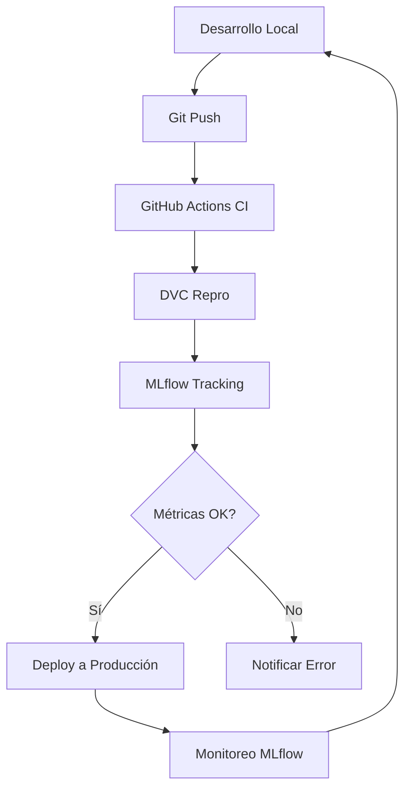

# MLOps Integration Guide: DVC + MLflow + CI/CD

## 🎯 Qué es MLOps y Por Qué Importa

**MLOps** (Machine Learning Operations) es la disciplina que aplica principios DevOps al Machine Learning para crear pipelines reproducibles, automatizados y escalables.

```yaml
MLOps = ML + DevOps + Data Engineering
```

### Objetivos Principales:

- ✅ **Reproducibilidad**: Mismo código → mismo resultado
- ✅ **Automatización**: Pipelines automáticos sin intervención manual
- ✅ **Monitoreo**: Seguimiento de modelos en producción
- ✅ **Colaboración**: Equipos trabajando de forma coordinada
- ✅ **Versionado**: Código, datos y modelos bajo control de versiones

## 🔧 Componentes del Ecosistema MLOps

### 1. DVC (Data Version Control): El Git para Datos

**¿Qué hace DVC?**

- 📁 **Versionado de Datos**: Rastrea cambios en datasets grandes
- 🔄 **Pipeline Automation**: Define etapas del ML pipeline
- 📊 **Dependency Tracking**: Sabe qué cambió y qué debe re-ejecutar
- ☁️ **Remote Storage**: Sincroniza datos con cloud (S3, GCS, etc.)

**Comandos Clave:**

```bash
dvc init                    # Inicializar DVC en el proyecto
dvc add data/raw/dataset.csv # Versionar archivo de datos
dvc repro                   # Ejecutar pipeline (solo lo que cambió)
dvc push                    # Subir datos al storage remoto
dvc pull                    # Descargar datos del storage remoto
```

### 2. MLflow: El Laboratorio Digital

**¿Qué hace MLflow?**

- 🔬 **Experimentos**: Registra cada ejecución del modelo
- 📊 **Métricas**: Accuracy, F1, precisión por clase, etc.
- ⚙️ **Parámetros**: Hiperparámetros y configuraciones
- 📁 **Artefactos**: Modelos, gráficos, archivos
- 🏷️ **Modelos**: Registro y versionado de modelos

**Comandos Clave:**

```bash
mlflow ui --port 5000           # Abrir interfaz web
mlflow experiments search       # Listar experimentos
mlflow models serve -m models:/ # Servir modelo
```

### 3. CI/CD: La Automatización

**¿Qué hace CI/CD?**

- 🤖 **Testing automático** en cada push
- 🔍 **Linting** y validación de código
- 🚀 **Deployment automático** a producción
- ✅ **Quality gates** (validación de métricas)

## 📋 Ejemplo Práctico: Mejorar el Modelo de Obesidad

### 1. DESARROLLO (Tu máquina)

```bash
# Cambias hiperparámetros en params.yaml
vim params.yaml  # n_estimators: 300 → 500

# DVC detecta el cambio y re-ejecuta pipeline
dvc repro        # Solo ejecuta train y evaluate (incremental!)

# MLflow registra automáticamente el nuevo experimento
# - Nuevo run con n_estimators=500
# - Métricas comparables con run anterior
# - Artefactos (matriz confusión, feature importance)

# Git versiona el cambio
git add params.yaml
git commit -m "feat: increase n_estimators to 500"
git push origin feature/improve-model
```

### 2. CI/CD (GitHub Actions - Automático)

```yaml
# Se activa al hacer push:
on: push

# Ejecuta automáticamente:
- Tests unitarios                    ✅
- dvc repro (pipeline completo)      ✅
- Validación: accuracy > 0.80        ✅
- Upload de artefactos               ✅
```

### 3. REVISIÓN (MLflow UI)

```bash
# Comparar experimentos:
mlflow ui  # http://localhost:5000

# Ver en interfaz:
┌─────────────────┬──────────┬──────────────┬─────────────┐
│ Experiment      │ Accuracy │ n_estimators │ F1-Score    │
├─────────────────┼──────────┼──────────────┼─────────────┤
│ run_123 (old)   │ 0.851    │ 300          │ 0.847       │
│ run_124 (new)   │ 0.863    │ 500          │ 0.859       │ ⭐ Mejor!
└─────────────────┴──────────┴──────────────┴─────────────┘
```

### 4. DEPLOYMENT (Producción)

```bash
# Si merge a main y métricas OK:
git merge feature/improve-model

# CI/CD despliega automáticamente:
- docker build                       🐳
- kubectl apply                      ☸️
- Monitoreo MLflow en producción     📊
```

## 🎯 BENEFICIOS DE LA INTEGRACIÓN

### Reproducibilidad

- **DVC**: Mismos datos + mismo código = mismo resultado
- **MLflow**: Registro completo de cada experimento
- **CI**: Validación automática en cada cambio

### Automatización

- **DVC repro**: Pipeline automático incremental
- **MLflow**: Tracking automático de experimentos
- **CI**: Tests y deployment automáticos

### Colaboración

- **Git**: Versionado de código
- **DVC**: Versionado de datos y pipelines
- **MLflow**: Experimentos compartidos
- **CI**: Validación colaborativa

### Calidad

- **Tests automáticos**: Código sin bugs
- **Validación de métricas**: Modelos que funcionan
- **Peer review**: Revisión de cambios
- **Monitoreo**: Detección temprana de problemas

## 🔗 Cómo Se Integran Los Componentes

### Flujo Completo de MLOps:



### Integración Práctica:

1. **DESARROLLO** (Local)

   ```bash
   # Modificas código/datos/parámetros
   vim params.yaml

   # DVC ejecuta pipeline automático (incremental)
   dvc repro

   # MLflow registra experimentos automáticamente
   # Git versiona cambios
   git commit + push
   ```

2. **CI/CD** (Automático)

   ```bash
   # GitHub Actions se activa automáticamente
   # Ejecuta tests + dvc repro + validación
   # Deploy si todo OK
   ```

3. **PRODUCCIÓN** (Automático)
   ```bash
   # Modelo deployado y monitoreado
   # Feedback loop para mejora continua
   ```

## 🚀 Comandos Prácticos en Este Proyecto

### Para Desarrollo:

```bash
# Ejecutar pipeline completo
dvc repro                           # Detecta cambios, ejecuta incremental
python run_mlops.py cli pipeline   # Alternativa manual

# Ver experimentos MLflow
mlflow ui --port 5000              # http://localhost:5000
python -m mlflow ui                # Si hay problemas de PATH

# Comparar experimentos
mlflow experiments search          # Lista todos los experimentos
```

### Para Producción:

```bash
# Validar modelo
python src/models/evaluate.py --data data/processed/features.csv \
                              --model_path models/mlflow_model

# Setup CI/CD (una sola vez)
git add .github/workflows/mlops-ci.yml
git commit -m "add: MLOps CI/CD pipeline"
git push
```

## 💡 Casos de Uso Comunes

### Caso 1: Experimento con Nuevos Hiperparámetros

```bash
# 1. Cambiar parámetros
vim params.yaml  # n_estimators: 300 → 500

# 2. DVC re-ejecuta automáticamente
dvc repro        # Solo train + evaluate (incremental)

# 3. Comparar en MLflow UI
mlflow ui        # Ver run nuevo vs anterior
```

### Caso 2: Nuevo Dataset

```bash
# 1. Agregar nuevos datos
cp new_data.csv data/raw/

# 2. DVC detecta cambio
dvc repro        # Re-ejecuta todo el pipeline

# 3. Validar resultados
python run_mlops.py cli evaluate
```

### Caso 3: Deploy a Producción

```bash
# 1. Merge a main (automático via CI)
git checkout main
git merge feature/new-model

# 2. CI valida y despliega automáticamente
# 3. Monitor en MLflow UI producción
```

## 📊 Tabla de Integración de Componentes

| Componente | Función Principal                      | Se Integra Con        | Archivo Clave                    |
| ---------- | -------------------------------------- | --------------------- | -------------------------------- |
| **DVC**    | Pipeline automático + versionado datos | Git, MLflow, CI       | `dvc.yaml`                       |
| **MLflow** | Tracking experimentos + modelos        | DVC, CI, Production   | `src/models/train.py`            |
| **CI/CD**  | Automatización + validación            | Git, DVC, MLflow      | `.github/workflows/mlops-ci.yml` |
| **Git**    | Versionado código                      | Todos los componentes | `.git/`                          |

## 🔍 Monitoreo y Debug

### Ver Logs de DVC:

```bash
dvc repro --verbose           # Ver detalles de ejecución
dvc dag                       # Ver grafo de dependencias
dvc status                    # Ver qué cambió
```

### Debug MLflow:

```bash
# Ver experimentos
mlflow experiments search

# Ver runs específicos
mlflow runs list --experiment-id <ID>

# Ver artefactos
ls mlruns//<experiment_id>/<run_id>/artifacts/
```

### Debug CI/CD:

```bash
# Ver logs en GitHub Actions
# GitHub repo > Actions > Workflow run > Logs

# Ejecutar localmente
act                          # Simula GitHub Actions localmente
```

## 🎯 Beneficios Medibles

### Antes vs Después de MLOps:

| Aspecto              | Antes (Manual)              | Después (MLOps)                  |
| -------------------- | --------------------------- | -------------------------------- |
| **Reproducibilidad** | ❌ "Funciona en mi máquina" | ✅ Reproducible 100%             |
| **Time to Deploy**   | 🐌 Días/semanas             | ⚡ Minutos/horas                 |
| **Errores en Prod**  | 🚨 Frecuentes               | ✅ Raros (validación automática) |
| **Colaboración**     | 😕 Difícil                  | 🤝 Fluida                        |
| **Rollback**         | 😰 Manual/lento             | ⏪ Automático/rápido             |

¡Esta documentación está ahora completa y guardada en tu proyecto para referencia futura!
