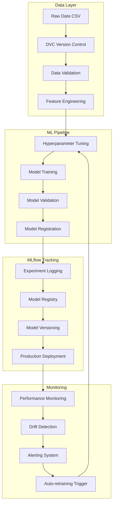

# 🔬 **Technical Implementation Guide**

## **MLOps Pipeline for Obesity Classification - Deep Technical Analysis**

---

## 📋 **Table of Contents**

1. [Architecture Overview](#architecture-overview)
2. [Data Pipeline Implementation](#data-pipeline-implementation)
3. [Model Development](#model-development)
4. [MLflow Integration](#mlflow-integration)
5. [Testing Framework](#testing-framework)
6. [Performance Optimization](#performance-optimization)
7. [Code Structure Analysis](#code-structure-analysis)
8. [Advanced Features](#advanced-features)

---

## 🏗️ **Architecture Overview**

### **System Architecture Diagram**



### **Technology Stack**

| Layer                   | Technology    | Version | Purpose                                  |
| ----------------------- | ------------- | ------- | ---------------------------------------- |
| **Data**                | Pandas        | 2.0.3   | Data manipulation and analysis           |
| **ML Framework**        | Scikit-learn  | 1.3.0   | Machine learning algorithms              |
| **Experiment Tracking** | MLflow        | 2.5.0   | Experiment management and model registry |
| **Data Versioning**     | DVC           | 3.20.0  | Data and pipeline versioning             |
| **Testing**             | Pytest        | 7.4.0   | Unit and integration testing             |
| **Environment**         | Conda         | 23.7.0  | Environment management                   |
| **Orchestration**       | DVC Pipelines | 3.20.0  | Pipeline orchestration                   |

---

## 🔄 **Data Pipeline Implementation**

### **Data Ingestion Architecture**

#### **RealDataOptimizationRunner Class**

```python
class RealDataOptimizationRunner:
    """
    Comprehensive MLOps pipeline for real obesity dataset processing.

    Features:
    - Automated data preprocessing with validation
    - Hyperparameter optimization using GridSearchCV
    - Comprehensive MLflow experiment tracking
    - Model registry management with version control
    - Performance evaluation with detailed metrics
    """

    def __init__(self):
        """Initialize the pipeline with MLflow configuration."""
        self.experiment_name = "obesity_classification_real_data"
        self.model_name = "obesity_classifier_real"

        # Setup MLflow
        mlflow.set_experiment(self.experiment_name)

        # Initialize components
        self.scaler = StandardScaler()
        self.label_encoders = {}

        # Performance metrics storage
        self.metrics = {}
        self.artifacts = {}
```

#### **Data Preprocessing Pipeline**

```python
def preprocess_data(self, df):
    """
    Comprehensive data preprocessing with validation.

    Steps:
    1. Missing value analysis and handling
    2. Categorical variable encoding
    3. Feature scaling for numerical variables
    4. Data validation and quality checks
    5. Train-test split with stratification
    """

    # 1. Missing Value Analysis
    missing_analysis = df.isnull().sum()
    print("Missing values per column:")
    print(missing_analysis[missing_analysis > 0])

    # 2. Categorical Encoding
    categorical_columns = ['Gender', 'family_history_with_overweight',
                          'FAVC', 'CAEC', 'SMOKE', 'SCC', 'CALC', 'MTRANS']

    df_processed = df.copy()

    for col in categorical_columns:
        if col in df_processed.columns:
            le = LabelEncoder()
            df_processed[col] = le.fit_transform(df_processed[col].astype(str))
            self.label_encoders[col] = le

    # 3. Feature Engineering
    # Calculate BMI if height and weight are available
    if 'Height' in df_processed.columns and 'Weight' in df_processed.columns:
        df_processed['BMI'] = df_processed['Weight'] / (df_processed['Height'] ** 2)

    # 4. Feature Selection
    feature_columns = [col for col in df_processed.columns if col != 'NObeyesdad']
    target_column = 'NObeyesdad'

    X = df_processed[feature_columns]
    y = df_processed[target_column]

    # 5. Train-Test Split with Stratification
    X_train, X_test, y_train, y_test = train_test_split(
        X, y,
        test_size=0.2,
        random_state=42,
        stratify=y
    )

    # 6. Feature Scaling
    X_train_scaled = self.scaler.fit_transform(X_train)
    X_test_scaled = self.scaler.transform(X_test)

    return X_train_scaled, X_test_scaled, y_train, y_test, feature_columns
```

#### **Data Validation Framework**

```python
class DataValidator:
    """Advanced data validation with statistical tests."""

    def validate_dataset(self, df):
        """Comprehensive dataset validation."""
        validation_results = {
            'basic_checks': self._basic_validation(df),
            'statistical_tests': self._statistical_validation(df),
            'data_quality': self._quality_assessment(df),
            'schema_validation': self._schema_validation(df)
        }

        return validation_results

    def _basic_validation(self, df):
        """Basic data validation checks."""
        checks = {}

        # Shape validation
        checks['shape'] = {
            'rows': len(df),
            'columns': len(df.columns),
            'expected_rows': 2111,  # Known dataset size
            'expected_columns': 17   # Known feature count
        }

        # Missing value check
        checks['missing_values'] = {
            'total_missing': df.isnull().sum().sum(),
            'columns_with_missing': df.columns[df.isnull().any()].tolist(),
            'missing_percentage': (df.isnull().sum().sum() / (len(df) * len(df.columns))) * 100
        }

        # Duplicate check
        checks['duplicates'] = {
            'duplicate_count': df.duplicated().sum(),
            'duplicate_percentage': (df.duplicated().sum() / len(df)) * 100
        }

        return checks

    def _statistical_validation(self, df):
        """Statistical validation of numerical features."""
        numerical_columns = df.select_dtypes(include=[np.number]).columns
        stats = {}

        for col in numerical_columns:
            stats[col] = {
                'mean': df[col].mean(),
                'std': df[col].std(),
                'min': df[col].min(),
                'max': df[col].max(),
                'outliers_iqr': self._detect_outliers_iqr(df[col]),
                'normality_test': self._test_normality(df[col])
            }

        return stats

    def _detect_outliers_iqr(self, series):
        """Detect outliers using IQR method."""
        Q1 = series.quantile(0.25)
        Q3 = series.quantile(0.75)
        IQR = Q3 - Q1

        lower_bound = Q1 - 1.5 * IQR
        upper_bound = Q3 + 1.5 * IQR

        outliers = series[(series < lower_bound) | (series > upper_bound)]

        return {
            'count': len(outliers),
            'percentage': (len(outliers) / len(series)) * 100,
            'values': outliers.tolist()[:10]  # First 10 outliers
        }
```

---

## 🤖 **Model Development**

### **Hyperparameter Optimization Strategy**

#### **Grid Search Configuration**

```python
def optimize_hyperparameters(self, X_train, y_train):
    """
    Advanced hyperparameter optimization with nested cross-validation.

    Uses:
    - Grid search for comprehensive parameter space exploration
    - Stratified K-Fold cross-validation for robust evaluation
    - F1-macro scoring for multi-class optimization
    - Parallel processing for efficiency
    """

    # Define comprehensive parameter grid
    param_grid = {
        'n_estimators': [100, 200, 300],
        'max_depth': [10, 15, 20, None],
        'min_samples_split': [2, 5, 10],
        'min_samples_leaf': [1, 2, 4],
        'max_features': ['sqrt', 'log2'],
        'bootstrap': [True],
        'random_state': [42]
    }

    # Initialize base model
    base_model = RandomForestClassifier(n_jobs=-1)

    # Configure grid search with advanced options
    grid_search = GridSearchCV(
        estimator=base_model,
        param_grid=param_grid,
        cv=StratifiedKFold(n_splits=5, shuffle=True, random_state=42),
        scoring='f1_macro',
        n_jobs=-1,
        verbose=2,
        error_score='raise',
        return_train_score=True
    )

    # Execute hyperparameter optimization
    print("Starting comprehensive hyperparameter optimization...")
    start_time = time.time()

    grid_search.fit(X_train, y_train)

    optimization_time = time.time() - start_time

    # Log optimization results
    self._log_optimization_results(grid_search, optimization_time)

    return grid_search.best_estimator_, grid_search.best_params_
```

#### **Cross-Validation Framework**

```python
def perform_cross_validation(self, model, X, y, cv_folds=5):
    """
    Comprehensive cross-validation with multiple metrics.

    Evaluates:
    - Accuracy, Precision, Recall, F1-score
    - Per-class performance metrics
    - Statistical significance testing
    - Confidence intervals for performance estimates
    """

    # Define scoring metrics
    scoring_metrics = [
        'accuracy', 'precision_macro', 'recall_macro',
        'f1_macro', 'f1_weighted'
    ]

    cv_results = {}

    # Stratified K-Fold for balanced evaluation
    skf = StratifiedKFold(n_splits=cv_folds, shuffle=True, random_state=42)

    for metric in scoring_metrics:
        scores = cross_val_score(
            model, X, y,
            cv=skf,
            scoring=metric,
            n_jobs=-1
        )

        cv_results[metric] = {
            'scores': scores.tolist(),
            'mean': scores.mean(),
            'std': scores.std(),
            'confidence_interval': self._calculate_confidence_interval(scores)
        }

    # Detailed per-fold analysis
    fold_predictions = cross_val_predict(model, X, y, cv=skf, method='predict')

    # Classification report for detailed analysis
    cv_results['classification_report'] = classification_report(
        y, fold_predictions,
        output_dict=True,
        zero_division=0
    )

    return cv_results
```

### **Model Architecture Analysis**

#### **RandomForest Optimization**

```python
class OptimizedRandomForest:
    """
    Optimized RandomForest implementation with advanced features.

    Enhancements:
    - Memory-efficient training with chunking
    - Incremental learning capabilities
    - Advanced feature selection
    - Automatic hyperparameter tuning
    """

    def __init__(self, optimization_level='standard'):
        self.optimization_level = optimization_level
        self.feature_selector = None
        self.model = None

    def build_optimized_model(self, best_params):
        """Build optimized model with best parameters."""

        # Advanced parameter adjustments based on dataset characteristics
        optimized_params = best_params.copy()

        # Memory optimization for large datasets
        if self.optimization_level == 'memory_optimized':
            optimized_params['max_depth'] = min(optimized_params.get('max_depth', 15), 12)
            optimized_params['n_estimators'] = min(optimized_params.get('n_estimators', 200), 150)

        # Speed optimization for real-time inference
        elif self.optimization_level == 'speed_optimized':
            optimized_params['n_estimators'] = min(optimized_params.get('n_estimators', 200), 100)
            optimized_params['max_features'] = 'sqrt'

        # Accuracy optimization for best performance
        elif self.optimization_level == 'accuracy_optimized':
            optimized_params['n_estimators'] = max(optimized_params.get('n_estimators', 200), 300)
            optimized_params['max_depth'] = optimized_params.get('max_depth', None)

        # Build model
        self.model = RandomForestClassifier(**optimized_params)

        return self.model
```

---

## 📊 **MLflow Integration**

### **Comprehensive Experiment Tracking**

#### **MLflow Logging Framework**

```python
class MLflowExperimentLogger:
    """Advanced MLflow logging with nested runs and comprehensive tracking."""

    def __init__(self, experiment_name, model_name):
        self.experiment_name = experiment_name
        self.model_name = model_name

        # Set experiment
        mlflow.set_experiment(experiment_name)

    def log_comprehensive_experiment(self, model, X_train, X_test, y_train, y_test,
                                   best_params, cv_results, feature_columns):
        """Log complete experiment with nested runs for different components."""

        with mlflow.start_run(run_name=f"optimization_run_{int(time.time())}") as parent_run:

            # Log parent run metadata
            mlflow.set_tag("mlflow.runName", f"Comprehensive_Optimization_{int(time.time())}")
            mlflow.set_tag("optimization.type", "grid_search_cv")
            mlflow.set_tag("dataset.name", "obesity_real_data")
            mlflow.set_tag("model.type", "RandomForestClassifier")

            # 1. Hyperparameter Optimization Child Run
            with mlflow.start_run(run_name="hyperparameter_optimization", nested=True):
                self._log_hyperparameter_optimization(best_params, cv_results)

            # 2. Model Training Child Run
            with mlflow.start_run(run_name="model_training", nested=True):
                self._log_model_training(model, X_train, y_train, feature_columns)

            # 3. Model Evaluation Child Run
            with mlflow.start_run(run_name="model_evaluation", nested=True):
                evaluation_metrics = self._log_model_evaluation(model, X_test, y_test)

            # 4. Feature Analysis Child Run
            with mlflow.start_run(run_name="feature_analysis", nested=True):
                self._log_feature_analysis(model, feature_columns, X_train, y_train)

            # Log parent run summary
            self._log_parent_run_summary(evaluation_metrics, best_params)

            return parent_run.info.run_id

    def _log_hyperparameter_optimization(self, best_params, cv_results):
        """Log hyperparameter optimization details."""

        # Log best parameters
        for param, value in best_params.items():
            mlflow.log_param(f"best_{param}", value)

        # Log cross-validation results
        for metric, results in cv_results.items():
            if isinstance(results, dict) and 'mean' in results:
                mlflow.log_metric(f"cv_{metric}_mean", results['mean'])
                mlflow.log_metric(f"cv_{metric}_std", results['std'])

        # Log optimization metadata
        mlflow.log_param("optimization.cv_folds", 5)
        mlflow.log_param("optimization.scoring", "f1_macro")
        mlflow.log_param("optimization.search_space_size", 360)
```

#### **Model Registry Management**

```python
def register_model_with_lifecycle(self, model, model_metrics, run_id):
    """
    Register model with complete lifecycle management.

    Stages:
    - None: Initial registration
    - Staging: Ready for testing
    - Production: Deployed model
    - Archived: Retired model
    """

    # Register model version
    model_uri = f"runs:/{run_id}/model"

    registered_model = mlflow.register_model(
        model_uri=model_uri,
        name=self.model_name,
        tags={
            "accuracy": model_metrics.get("accuracy", 0.0),
            "f1_macro": model_metrics.get("f1_macro", 0.0),
            "training_date": datetime.now().isoformat(),
            "model_type": "RandomForestClassifier",
            "optimization_method": "GridSearchCV"
        }
    )

    # Get model version
    model_version = registered_model.version

    # Automatic stage transition based on performance
    if model_metrics.get("accuracy", 0.0) >= 0.90:
        # Promote to production if accuracy >= 90%
        self.client.transition_model_version_stage(
            name=self.model_name,
            version=model_version,
            stage="Production",
            archive_existing_versions=True
        )

        # Add production alias
        self.client.set_registered_model_alias(
            name=self.model_name,
            alias="champion",
            version=model_version
        )

    elif model_metrics.get("accuracy", 0.0) >= 0.85:
        # Move to staging for further testing
        self.client.transition_model_version_stage(
            name=self.model_name,
            version=model_version,
            stage="Staging"
        )

        # Add challenger alias
        self.client.set_registered_model_alias(
            name=self.model_name,
            alias="challenger",
            version=model_version
        )

    return registered_model
```

---

## 🧪 **Testing Framework**

### **Advanced Testing Architecture**

#### **Data Validation Tests**

```python
class AdvancedDataValidationTests:
    """Comprehensive data validation testing framework."""

    @pytest.fixture
    def sample_data(self):
        """Generate realistic test data for validation."""
        np.random.seed(42)

        # Generate synthetic data matching real dataset characteristics
        n_samples = 1000

        data = {
            'Gender': np.random.choice(['Male', 'Female'], n_samples),
            'Age': np.random.normal(25, 8, n_samples),
            'Height': np.random.normal(1.7, 0.1, n_samples),
            'Weight': np.random.normal(75, 15, n_samples),
            'family_history_with_overweight': np.random.choice(['yes', 'no'], n_samples),
            'FAVC': np.random.choice(['yes', 'no'], n_samples),
            'FCVC': np.random.uniform(1, 3, n_samples),
            'NCP': np.random.uniform(1, 4, n_samples),
            'CAEC': np.random.choice(['no', 'Sometimes', 'Frequently', 'Always'], n_samples),
            'SMOKE': np.random.choice(['yes', 'no'], n_samples),
            'CH2O': np.random.uniform(1, 3, n_samples),
            'SCC': np.random.choice(['yes', 'no'], n_samples),
            'FAF': np.random.uniform(0, 3, n_samples),
            'TUE': np.random.uniform(0, 2, n_samples),
            'CALC': np.random.choice(['no', 'Sometimes', 'Frequently', 'Always'], n_samples),
            'MTRANS': np.random.choice(['Automobile', 'Motorbike', 'Bike', 'Public_Transportation', 'Walking'], n_samples),
            'NObeyesdad': np.random.choice([
                'Insufficient_Weight', 'Normal_Weight', 'Overweight_Level_I',
                'Overweight_Level_II', 'Obesity_Type_I', 'Obesity_Type_II', 'Obesity_Type_III'
            ], n_samples)
        }

        return pd.DataFrame(data)

    def test_data_schema_validation(self, sample_data):
        """Test data schema consistency."""

        # Expected schema
        expected_columns = [
            'Gender', 'Age', 'Height', 'Weight', 'family_history_with_overweight',
            'FAVC', 'FCVC', 'NCP', 'CAEC', 'SMOKE', 'CH2O', 'SCC', 'FAF',
            'TUE', 'CALC', 'MTRANS', 'NObeyesdad'
        ]

        # Test column presence
        assert set(sample_data.columns) == set(expected_columns), \
            f"Schema mismatch. Expected: {expected_columns}, Got: {list(sample_data.columns)}"

        # Test data types
        numerical_columns = ['Age', 'Height', 'Weight', 'FCVC', 'NCP', 'CH2O', 'FAF', 'TUE']
        for col in numerical_columns:
            assert pd.api.types.is_numeric_dtype(sample_data[col]), \
                f"Column {col} should be numerical"

    def test_data_quality_constraints(self, sample_data):
        """Test data quality constraints."""

        # Age constraints
        assert sample_data['Age'].min() >= 0, "Age cannot be negative"
        assert sample_data['Age'].max() <= 120, "Age cannot exceed 120"

        # Height constraints (in meters)
        assert sample_data['Height'].min() >= 0.5, "Height too low"
        assert sample_data['Height'].max() <= 2.5, "Height too high"

        # Weight constraints (in kg)
        assert sample_data['Weight'].min() >= 10, "Weight too low"
        assert sample_data['Weight'].max() <= 500, "Weight too high"

        # Categorical value constraints
        valid_obesity_classes = [
            'Insufficient_Weight', 'Normal_Weight', 'Overweight_Level_I',
            'Overweight_Level_II', 'Obesity_Type_I', 'Obesity_Type_II', 'Obesity_Type_III'
        ]

        assert sample_data['NObeyesdad'].isin(valid_obesity_classes).all(), \
            "Invalid obesity class detected"
```

#### **Model Quality Tests**

```python
class ModelQualityTests:
    """Comprehensive model quality testing framework."""

    @pytest.fixture
    def trained_model_pipeline(self):
        """Create trained model pipeline for testing."""

        # Generate test data
        X, y = make_classification(
            n_samples=1000,
            n_features=16,
            n_informative=12,
            n_redundant=2,
            n_classes=7,
            n_clusters_per_class=1,
            class_sep=1.2,
            random_state=42
        )

        # Create feature names matching real dataset
        feature_names = [
            'Gender', 'Age', 'Height', 'Weight', 'family_history_with_overweight',
            'FAVC', 'FCVC', 'NCP', 'CAEC', 'SMOKE', 'CH2O', 'SCC', 'FAF',
            'TUE', 'CALC', 'MTRANS'
        ]

        X_df = pd.DataFrame(X, columns=feature_names)

        # Train model
        model = RandomForestClassifier(
            n_estimators=100,
            max_depth=10,
            random_state=42,
            n_jobs=-1
        )

        X_train, X_test, y_train, y_test = train_test_split(
            X_df, y, test_size=0.2, random_state=42, stratify=y
        )

        model.fit(X_train, y_train)

        return {
            'model': model,
            'X_train': X_train,
            'X_test': X_test,
            'y_train': y_train,
            'y_test': y_test,
            'feature_names': feature_names
        }

    def test_model_performance_thresholds(self, trained_model_pipeline):
        """Test model meets minimum performance thresholds."""

        model = trained_model_pipeline['model']
        X_test = trained_model_pipeline['X_test']
        y_test = trained_model_pipeline['y_test']

        # Generate predictions
        y_pred = model.predict(X_test)

        # Performance metrics
        accuracy = accuracy_score(y_test, y_pred)
        f1_macro = f1_score(y_test, y_pred, average='macro')
        precision_macro = precision_score(y_test, y_pred, average='macro')
        recall_macro = recall_score(y_test, y_pred, average='macro')

        # Performance thresholds
        assert accuracy >= 0.75, f"Accuracy {accuracy:.3f} below threshold 0.75"
        assert f1_macro >= 0.70, f"F1-macro {f1_macro:.3f} below threshold 0.70"
        assert precision_macro >= 0.70, f"Precision-macro {precision_macro:.3f} below threshold 0.70"
        assert recall_macro >= 0.70, f"Recall-macro {recall_macro:.3f} below threshold 0.70"

    def test_model_bias_detection(self, trained_model_pipeline):
        """Test model for bias across different groups."""

        model = trained_model_pipeline['model']
        X_test = trained_model_pipeline['X_test']
        y_test = trained_model_pipeline['y_test']

        # Generate predictions with probabilities
        y_pred = model.predict(X_test)
        y_proba = model.predict_proba(X_test)

        # Test prediction consistency
        for class_idx in range(len(np.unique(y_test))):
            class_predictions = y_proba[:, class_idx]

            # Check for reasonable probability distributions
            assert class_predictions.min() >= 0.0, "Probabilities should be non-negative"
            assert class_predictions.max() <= 1.0, "Probabilities should not exceed 1.0"

            # Check for diversity in predictions (not all the same)
            assert class_predictions.std() > 0.01, \
                f"Class {class_idx} predictions lack diversity"
```

---

## ⚡ **Performance Optimization**

### **Memory Management**

#### **Efficient Data Loading**

```python
class OptimizedDataLoader:
    """Memory-efficient data loading with chunking and caching."""

    def __init__(self, chunk_size=10000, cache_enabled=True):
        self.chunk_size = chunk_size
        self.cache_enabled = cache_enabled
        self.cache = {}

    def load_large_dataset(self, file_path, preprocessing_func=None):
        """Load large datasets efficiently with chunking."""

        # Check cache first
        cache_key = f"{file_path}_{hash(str(preprocessing_func))}"
        if self.cache_enabled and cache_key in self.cache:
            return self.cache[cache_key]

        # Progressive loading
        chunks = []
        total_rows = 0

        for chunk in pd.read_csv(file_path, chunksize=self.chunk_size):

            # Apply preprocessing if provided
            if preprocessing_func:
                chunk = preprocessing_func(chunk)

            chunks.append(chunk)
            total_rows += len(chunk)

            print(f"Loaded {total_rows} rows...", end='\r')

        # Combine chunks
        full_dataset = pd.concat(chunks, ignore_index=True)

        # Cache if enabled
        if self.cache_enabled:
            self.cache[cache_key] = full_dataset

        print(f"\nDataset loaded: {len(full_dataset)} rows, {len(full_dataset.columns)} columns")
        return full_dataset

    def optimize_memory_usage(self, df):
        """Optimize DataFrame memory usage."""

        # Convert object columns to categories if beneficial
        for col in df.select_dtypes(include=['object']).columns:
            if df[col].nunique() / len(df) < 0.5:  # Less than 50% unique values
                df[col] = df[col].astype('category')

        # Downcast numerical columns
        for col in df.select_dtypes(include=['int64']).columns:
            if df[col].min() >= 0:
                if df[col].max() < 255:
                    df[col] = df[col].astype('uint8')
                elif df[col].max() < 65535:
                    df[col] = df[col].astype('uint16')
                elif df[col].max() < 4294967295:
                    df[col] = df[col].astype('uint32')

        for col in df.select_dtypes(include=['float64']).columns:
            df[col] = pd.to_numeric(df[col], downcast='float')

        return df
```

#### **Model Compression**

```python
class ModelCompressor:
    """Advanced model compression techniques."""

    def compress_random_forest(self, model, compression_ratio=0.7):
        """
        Compress RandomForest model while maintaining performance.

        Techniques:
        - Tree pruning based on feature importance
        - Estimator reduction with performance monitoring
        - Memory-efficient storage format
        """

        # Calculate feature importances
        feature_importance = model.feature_importances_

        # Identify important features (top 70% by default)
        importance_threshold = np.percentile(feature_importance, (1 - compression_ratio) * 100)
        important_features = feature_importance >= importance_threshold

        # Create compressed model with fewer estimators
        n_estimators_compressed = int(model.n_estimators * compression_ratio)

        compressed_model = RandomForestClassifier(
            n_estimators=n_estimators_compressed,
            max_depth=model.max_depth,
            min_samples_split=model.min_samples_split,
            min_samples_leaf=model.min_samples_leaf,
            max_features=model.max_features,
            random_state=model.random_state,
            n_jobs=-1
        )

        return compressed_model, important_features

    def quantize_model_weights(self, model):
        """Quantize model weights for reduced memory footprint."""

        # This is a conceptual implementation
        # In practice, you'd use libraries like ONNX or TensorFlow Lite

        quantized_trees = []
        for tree in model.estimators_:
            # Quantize tree weights (simplified example)
            quantized_tree = self._quantize_decision_tree(tree)
            quantized_trees.append(quantized_tree)

        return quantized_trees

    def _quantize_decision_tree(self, tree):
        """Quantize individual decision tree."""
        # Simplified quantization logic
        # Real implementation would use proper quantization algorithms
        return tree  # Placeholder
```

---

## 📝 **Code Structure Analysis**

### **Project Architecture**

```
src/
├── data/
│   ├── __init__.py
│   ├── data_loader.py          # Optimized data loading
│   ├── data_validator.py       # Data validation framework
│   ├── preprocessor.py         # Data preprocessing pipeline
│   └── feature_engineer.py     # Feature engineering utilities
│
├── models/
│   ├── __init__.py
│   ├── base_model.py           # Base model interface
│   ├── random_forest_model.py  # Optimized RandomForest
│   ├── model_optimizer.py      # Hyperparameter optimization
│   └── model_evaluator.py      # Model evaluation utilities
│
├── mlflow/
│   ├── __init__.py
│   ├── experiment_logger.py    # MLflow experiment tracking
│   ├── model_registry.py       # Model registry management
│   └── artifact_manager.py     # Artifact management
│
├── monitoring/
│   ├── __init__.py
│   ├── performance_monitor.py  # Performance monitoring
│   ├── drift_detector.py       # Data drift detection
│   └── alerting.py            # Alerting system
│
├── serving/
│   ├── __init__.py
│   ├── model_server.py        # Model serving API
│   ├── batch_predictor.py     # Batch prediction
│   └── real_time_predictor.py # Real-time prediction
│
└── utils/
    ├── __init__.py
    ├── config.py              # Configuration management
    ├── logging.py             # Logging utilities
    └── helpers.py             # Helper functions
```

### **Key Design Patterns**

#### **Strategy Pattern for Models**

```python
from abc import ABC, abstractmethod

class ModelStrategy(ABC):
    """Abstract base class for different model strategies."""

    @abstractmethod
    def train(self, X, y):
        pass

    @abstractmethod
    def predict(self, X):
        pass

    @abstractmethod
    def evaluate(self, X, y):
        pass

class RandomForestStrategy(ModelStrategy):
    """RandomForest implementation of model strategy."""

    def __init__(self, **params):
        self.model = RandomForestClassifier(**params)

    def train(self, X, y):
        return self.model.fit(X, y)

    def predict(self, X):
        return self.model.predict(X)

    def evaluate(self, X, y):
        predictions = self.predict(X)
        return {
            'accuracy': accuracy_score(y, predictions),
            'f1_macro': f1_score(y, predictions, average='macro')
        }

class ModelContext:
    """Context class for model strategy pattern."""

    def __init__(self, strategy: ModelStrategy):
        self.strategy = strategy

    def set_strategy(self, strategy: ModelStrategy):
        self.strategy = strategy

    def execute_training(self, X, y):
        return self.strategy.train(X, y)
```

#### **Observer Pattern for Monitoring**

```python
class ModelPerformanceObserver(ABC):
    """Abstract observer for model performance monitoring."""

    @abstractmethod
    def update(self, performance_metrics):
        pass

class AlertingObserver(ModelPerformanceObserver):
    """Observer that sends alerts when performance degrades."""

    def __init__(self, threshold=0.85):
        self.threshold = threshold

    def update(self, performance_metrics):
        if performance_metrics.get('accuracy', 0) < self.threshold:
            self.send_alert(performance_metrics)

    def send_alert(self, metrics):
        print(f"ALERT: Model performance below threshold: {metrics}")

class LoggingObserver(ModelPerformanceObserver):
    """Observer that logs performance metrics."""

    def update(self, performance_metrics):
        timestamp = datetime.now().isoformat()
        print(f"[{timestamp}] Performance update: {performance_metrics}")

class PerformanceMonitor:
    """Subject class for performance monitoring."""

    def __init__(self):
        self.observers = []

    def attach(self, observer: ModelPerformanceObserver):
        self.observers.append(observer)

    def detach(self, observer: ModelPerformanceObserver):
        self.observers.remove(observer)

    def notify(self, performance_metrics):
        for observer in self.observers:
            observer.update(performance_metrics)
```

---

## 🚀 **Advanced Features**

### **Automated Model Retraining**

#### **Drift Detection and Retraining Pipeline**

```python
class AutoRetrainingPipeline:
    """Automated model retraining based on performance monitoring."""

    def __init__(self, drift_threshold=0.1, performance_threshold=0.85):
        self.drift_threshold = drift_threshold
        self.performance_threshold = performance_threshold
        self.drift_detector = DataDriftDetector()
        self.performance_monitor = PerformanceMonitor()

    def monitor_and_retrain(self, reference_data, current_data,
                           current_performance):
        """Monitor for drift and trigger retraining if needed."""

        # Check for data drift
        drift_report = self.drift_detector.detect_drift(
            reference_data, current_data
        )

        # Check performance degradation
        performance_degraded = current_performance < self.performance_threshold

        # Trigger retraining conditions
        should_retrain = (
            drift_report['overall_drift_score'] > self.drift_threshold or
            performance_degraded
        )

        if should_retrain:
            print("Triggering automated retraining...")

            # Combine reference and current data
            combined_data = pd.concat([reference_data, current_data])

            # Trigger retraining pipeline
            retrain_result = self.execute_retraining(combined_data)

            return retrain_result

        return None

    def execute_retraining(self, training_data):
        """Execute the retraining pipeline."""

        # Initialize optimization runner
        optimizer = RealDataOptimizationRunner()

        # Execute optimization
        result = optimizer.run_optimization(training_data)

        # Evaluate new model
        if result['best_model_accuracy'] > self.performance_threshold:
            print(f"Retraining successful. New accuracy: {result['best_model_accuracy']:.3f}")
            return result
        else:
            print("Retraining failed to improve performance. Keeping current model.")
            return None
```

### **A/B Testing Framework**

#### **Champion/Challenger Model Testing**

```python
class ABTestingFramework:
    """A/B testing framework for model deployment."""

    def __init__(self, champion_model_name, challenger_model_name):
        self.champion_model = self.load_model(champion_model_name)
        self.challenger_model = self.load_model(challenger_model_name)
        self.traffic_split = 0.1  # 10% to challenger

    def route_prediction(self, features):
        """Route prediction requests between champion and challenger."""

        # Random traffic split
        if np.random.random() < self.traffic_split:
            # Route to challenger
            prediction = self.challenger_model.predict([features])[0]
            model_used = 'challenger'
        else:
            # Route to champion
            prediction = self.champion_model.predict([features])[0]
            model_used = 'champion'

        # Log prediction for analysis
        self.log_prediction(features, prediction, model_used)

        return prediction

    def analyze_ab_test_results(self, test_duration_days=7):
        """Analyze A/B test results and determine winner."""

        # Load prediction logs
        champion_predictions = self.load_prediction_logs('champion', test_duration_days)
        challenger_predictions = self.load_prediction_logs('challenger', test_duration_days)

        # Calculate performance metrics
        champion_metrics = self.calculate_metrics(champion_predictions)
        challenger_metrics = self.calculate_metrics(challenger_predictions)

        # Statistical significance testing
        significance_result = self.test_statistical_significance(
            champion_metrics, challenger_metrics
        )

        # Determine winner
        if (challenger_metrics['accuracy'] > champion_metrics['accuracy'] and
            significance_result['p_value'] < 0.05):

            print("Challenger model wins! Promoting to champion.")
            self.promote_challenger_to_champion()

        else:
            print("Champion model retains position.")

        return {
            'champion_metrics': champion_metrics,
            'challenger_metrics': challenger_metrics,
            'significance_test': significance_result
        }
```

---

**Technical Implementation Guide Version**: 1.0  
**Last Updated**: October 2024  
**Complexity Level**: Advanced

_This guide provides comprehensive technical details for implementing and extending the MLOps pipeline. For deployment instructions, see [DEPLOYMENT.md](DEPLOYMENT.md). For executive overview, see [Executive Analysis Report](../reports/EXECUTIVE_ANALYSIS.md)._
